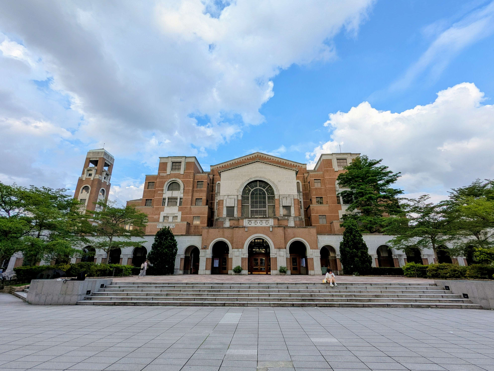
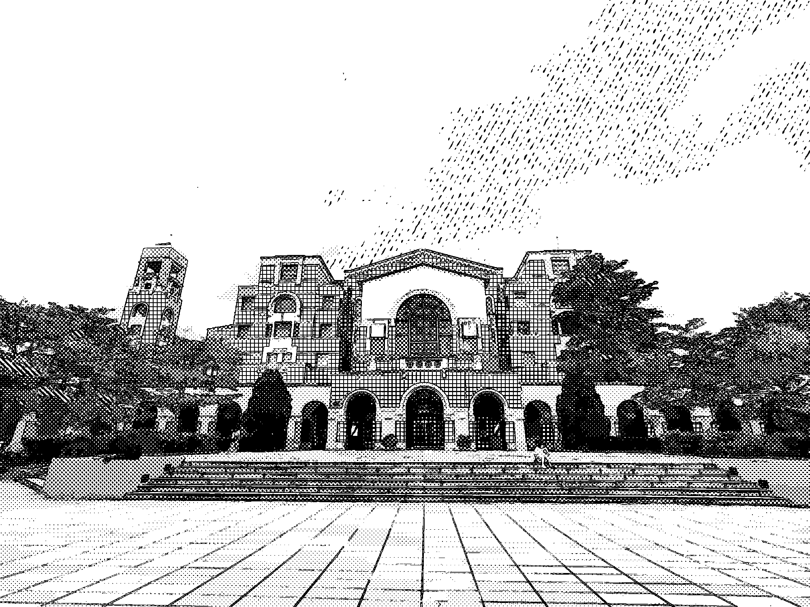
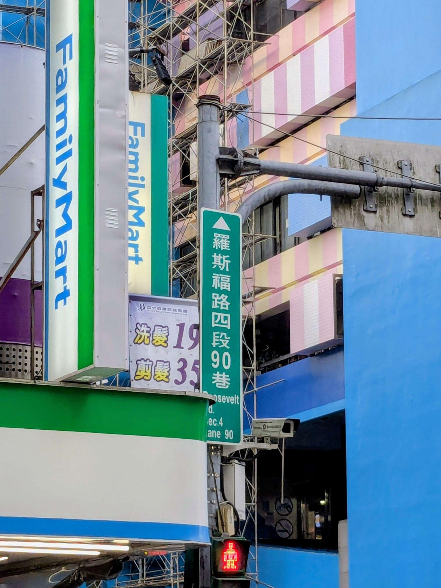
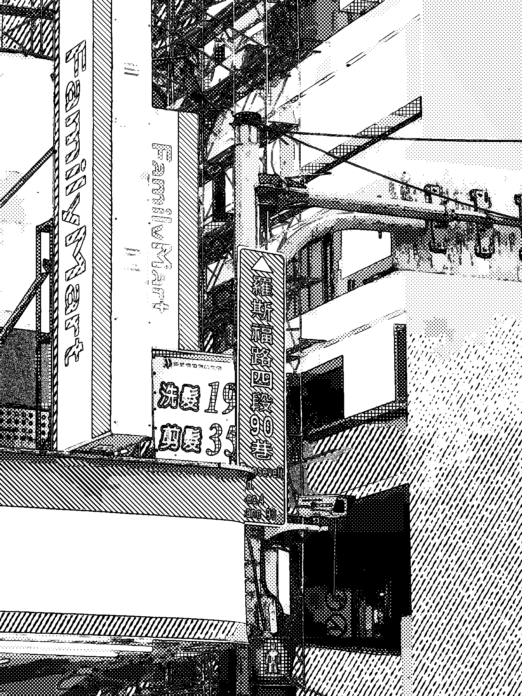

# Manga-Style Conversion of Natural Images via Adaptive Screentones

## Setup
```bash
pip install -r requirements.txt
```

## Code Execution
Generate screentone library:
```bash
python generate_screentone.py
```
Convert image to manga style:
```bash
python convert_manga.py
```
You can modify the parameters at the top of the `convert_manga.py`, including input/output file paths, screentone types to use and whether to apply histogram equalization.

## Examples
### Example1
NTU library:


Converted manga style:


### Example2
City street:


Converted manga style:
